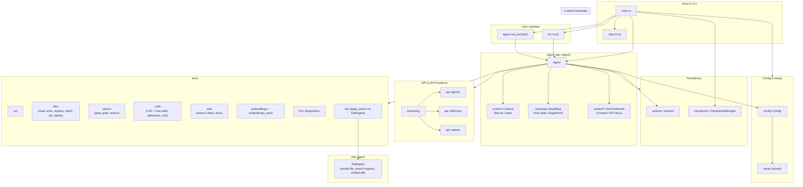
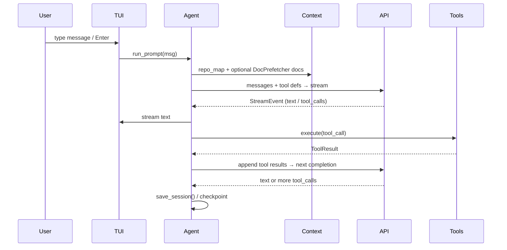

# Forge-rs Project Architecture

## High-level architecture diagram



## Layer overview

| Layer | Responsibility |
|-------|----------------|
| **Entry** | `main.rs` parses CLI (clap), expands workdir, runs setup if needed, creates checkpoint, then either runs a subcommand, single-shot `run_prompt`, or interactive `tui::run(agent)`. |
| **Config** | Provider, model, API keys, auto-approve rules, plan mode, edit format. Loaded from `~/.config/forge` (or similar). |
| **Persistence** | **Session**: conversation history per workdir, saved under data dir. **Checkpoint**: shadow git repo for undo/restore/diff of workspace. |
| **TUI** | ratatui + crossterm. Renders chat, input, tool status, command palette, model picker. Handles key events and calls into `Agent`. |
| **Agent** | Holds config, workdir, context, repo_map, doc_prefetcher, messages, session. Builds system prompt (repo map + optional prefetched docs). Loop: `get_completion_streaming()` → text or tool_calls → execute tools → append results → repeat. |
| **Context** | **Context**: walk workdir, collect file list + line counts + language. **RepoMap**: tree-sitter tags → file graph → PageRank → fit within token budget. **DocPrefetcher**: background Context7 API search/fetch, cache, inject into next turn. |
| **API** | **streaming**: SSE/stream handling. **gemini**, **anthropic**, **openai**: provider-specific request/response and function-calling. Agent chooses provider from config. |
| **Tools** | File ops, search (grep/glob/semantic), code (LSP + tree-sitter), web (search/fetch/docs), run, embeddings store, diagnostics. Tool results go back into the conversation. |
| **edit_agent** | Specialized edit generation (whole-file, search-replace, unified-diff). Used by tools (e.g. ide/apply_patch) for reliable code edits. |

## Data flow (single turn)



## Directory layout (conceptual)

```
src/
├── main.rs           # CLI, wiring, checkpoint creation, tui vs single-shot
├── config/           # Config load/save, auto_approve, models list
├── setup.rs          # First-run wizard (provider, API key)
├── session.rs        # Session new/load/save/list (by workdir)
├── checkpoint/       # Shadow git: create, undo, restore, diff
├── api/              # Agent + Message, provider clients, streaming
│   ├── mod.rs        # Agent, run_prompt loop, get_completion_streaming
│   ├── gemini.rs
│   ├── anthropic.rs
│   ├── openai.rs
│   └── streaming.rs
├── context/          # File list, stats (walkdir)
├── context7/         # DocPrefetcher (Context7 API)
├── repomap/          # RepoMap (tree-sitter, graph, PageRank)
├── tools/            # Tool enum, execute(), definitions for LLM
│   ├── files.rs, search.rs, code.rs, web.rs, execute.rs
│   ├── embeddings.rs, embeddings_store.rs, treesitter.rs
│   ├── ide.rs, lint.rs
│   └── mod.rs
├── edit_agent.rs     # EditRequest/EditResult, parse_response, formats
├── lsp/              # LSP client, languages, types (for code tools)
└── tui/              # App state, ratatui widgets, event loop
```

## Dependencies (conceptual)

- **Agent** depends on: config, context, context7, repomap, session, tools, api (providers).
- **Tools** depend on: workdir, optional LSP (lsp/), embeddings_store, edit_agent (for ide).
- **TUI** depends on: Agent, checkpoint (optional), tools (for approval UI).

This file is the single source of truth for the project architecture diagram and layer overview.
